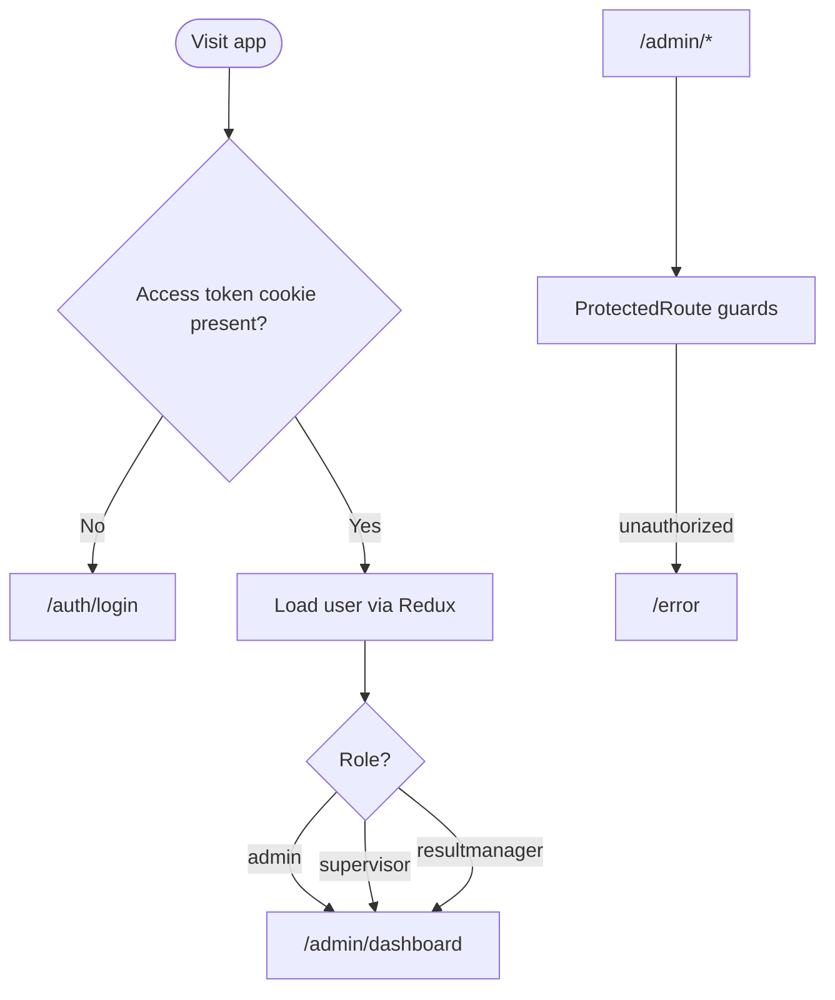
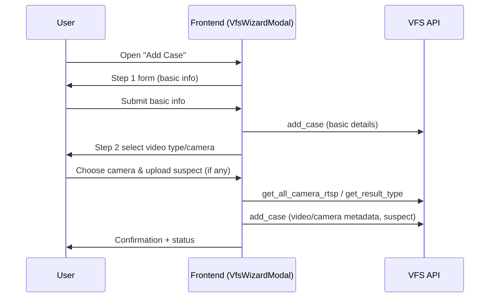
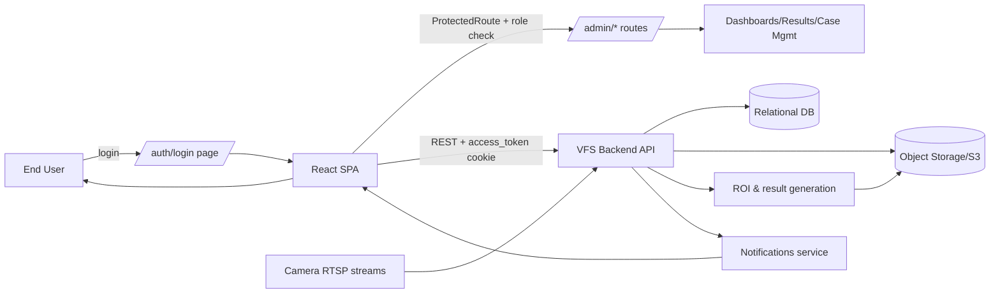

# Project Functionality Overview

| Tag | Area | What it Does | Notes |
| --- | --- | --- | --- |
| auth | Authentication & role-based access | HashRouter-based auth flow with login, registration, and forgot-password; stores `access_token` cookie and loads user via Redux; redirects users by role to dashboards | Roles: `admin`, `supervisor`, `resultmanager`; `ProtectedRoute` blocks unauthorized users and sends them to `/auth/login` or `/error` |
| routing | Navigation shell | Common `Layout` wrapper with route tree under `/admin/*`; default redirect to dashboard based on role; error fallback at `/error` | Uses React Router v6 `useRoutes` plus lazy-loaded pages (`AdminBasePage`, `LoginRoutes`) |
| dashboards | Operational analytics | Multiple dashboards for case status, result-type distribution, chair occupancy, crowd counts, and abandoned-object trends with date-range filters | Backed by VFS API endpoints (`result_type_count`, `case_status_count_percentage`, `chair_occupancy_count`, `get_result`); drilldown charts in `Dashboard` and specialized views for crowd/occupancy/object-left-behind |
| case-management | Investing Forensic case workspace | Case list with search/pagination; create new case via multi-step wizard (basic info, video type, camera selection, suspect upload); view case details, reports, and status history | Implemented in `VfsManage` + `VfsWizardModal`; uses VFS actions (`add_case`, `get_case`, `generate_case_report`, `case_status`) |
| results | Result review & evidence | Unified results page filtered by date range, location, camera, and result type (case, crowd, occupancy, abandoned object); paginated cards with bounding boxes and modal viewer | Uses `get_result`/`get_result_by_ids`; supports timezone-aware timestamps and pagination; modal shows labels, location, camera metadata |
| camera | Camera inventory & ROI | Camera table with search/pagination, add/import camera flows, ROI drawing & update, and use-case mapping per camera; fetch latest frame for ROI overlay | API calls include `/get_all_camera_rtsp`, `/get_latest_frame_by_rtsp`, `/get_camera_roi`, `/update_camera_roi`, `/get_result_type`; ROI tools use `RegionSelect` and `image-bounding-box-custom` |
| location | Location master data | CRUD for locations with search, pagination, and status updates; modal-based add/edit forms | Endpoints: `/get_current_user_locations`, `/add_location`, `/update_location`; integrates toast feedback and Redux slice `LocationSlice` |
| licence | License visibility | Displays license keys, current camera usage, activation and expiry dates in a compact card | Data loaded via `get_license_details` (VFS actions); currently read-only UI |
| notifications | User alerts | Notification dropdown fetches unread camera notifications; supports “view all” and unread counter | Resides in Metronic extras; pulls data via `getCameraNotification` (API helper) |
| subscription-metrics | Model subscription graphs | Highcharts-based subscription dashboards for model usage and rates with drilldown | Located in `modules/DashboardGraph`; fetches graph data via `_redux` helpers |
| devops | Build & delivery | Node/Nginx Dockerfile for static build and serve; Jenkins pipeline builds per branch (dev/prod) and deploys to S3 buckets; env-cmd driven profiles for dev/prod/local | Relevant files: `Dockerfile`, `Jenkinsfile`, `package.json` scripts, `serve.json`; environment variables provide `REACT_APP_IP` and `REACT_APP_API_HOST` |

## Diagrams

### System Context
```mermaid
graph TD;
  User[End User (admin/supervisor/resultmanager)] -->|browser| FE[React SPA (VFS Frontend)];
  FE -->|REST| API[VFS Backend API];
  API --> DB[(Database)];
  API --> Storage[(Object Storage/S3)];
  FE --> AuthCookie[Access Token Cookie];
  AuthCookie --> FE;
  Jenkins[Jenkins Pipeline] -->|deploy build| S3[S3 Static Hosting];
  S3 -->|serve| User;
```

### Frontend Module Map
```mermaid
graph LR
  FE[App Shell / Layout] --> AuthRoutes[Auth Routes]
  FE --> AdminRoutes[/admin/* Routes]
  AdminRoutes --> Dashboards[Dashboards]
  AdminRoutes --> Cases[Case Management]
  AdminRoutes --> Results[Results Review]
  AdminRoutes --> Cameras[Camera Inventory + ROI]
  AdminRoutes --> Locations[Locations CRUD]
  AdminRoutes --> License[License View]
  AdminRoutes --> Notifications[Notifications Dropdown]
  AdminRoutes --> Subs[Subscription Graphs]
```

### Auth & Routing Flow


### Case Creation (Wizard)


### Deployment / CI-CD
```mermaid
flowchart LR
  Dev[Dev/Prod Branch Push] --> Jenkins[Jenkinsfile]
  Jenkins --> Build[Node build (env-cmd profiles)]
  Build --> Artifact[Static bundle]
  Artifact --> S3Deploy[S3 bucket deploy]
  S3Deploy --> Nginx[Nginx serves built assets]
  Nginx --> Users[End Users via browser]
```

### End-to-End System Flow



